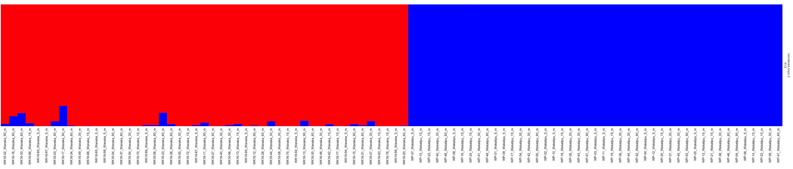

##Summary

In this quick example script, we will examplify basic population genetics analyses of a GBS a dataset of *Gobiomorphus cotidianus* between two New Zealand lake: Wakatipu (WP) and Wanaka (WK).

For any questions or access to data files to dutoit.ludovic@gmail.com. The pipeline require several R packages for different parts that should be installed in your system. The links below refer to all the installations:

* [pcadapt](https://cran.r-project.org/web/packages/pcadapt/vignettes/pcadapt.html)
* [hierfstat](https://github.com/jgx65/hierfstat)
* [vcfR](https://rdrr.io/cran/vcfR/)
* [poppr](https://cran.r-project.org/web/packages/poppr/readme/README.html)
* [pophelper](http://www.royfrancis.com/pophelper/articles/index.html)

## Loading files
```{r,,message=F}
require("pcadapt")
data <- read.pcadapt("populations.snps.vcf", type = "vcf") # New dataset https://github.com/ldutoit/bully_gbs/blob/master/populationstructure_tuto/populations.snps.vcf
```

94 individuals and 9605 variants.


Now, onto loading some metadata:

```{r}
##Load some metadata
metadata<-read.table("metadata_clean.txt",h=T)# # (This fileis available https://github.com/ldutoit/)bully_gbs/blob/master/populationstructure_tuto/metadata/metadata_clean.txt) 
head(metadata)
```

### Basic statistics

Let's get some basic population stats (Fst, Ho)

```{r}
require("hierfstat") ## install those packages first https://github.com/jgx65/hierfstat
require("vcfR")
require("poppr")
# a bit of play around wqith convewrsion to get a vcf into hierfstat
dataVCF<- read.vcfR("populations.snps.vcf", verbose = T)
geninddata<-vcfR2genind(dataVCF)# convert data from vcf object to genind
geninddata@pop<-(metadata[,2]) # assign populations
head(geninddata@pop)
```


```{r}
#Make 4 pops, shallow and deep for both lakes
hierfstatdataall <-genind2hierfstat(geninddata,pop=paste(metadata[,2],metadata[,4],sep=""))
levels(hierfstatdataall$pop) # checking we have for pops
basic.stats(hierfstatdataall)$overall # get the basic stats
```

Some important information in there! Let's also do a pwiarwise Fst Matrix based on Weir and Cockerham, 1984.

```{r}
matrix_4_depth_fst<-as.matrix(genet.dist(hierfstatdataall,,method="WC84"))
colnames(matrix_4_depth_fst)<-levels(hierfstatdataall$pop)
rownames(matrix_4_depth_fst)<-levels(hierfstatdataall$pop)
matrix_4_depth_fst
```
Little structure by depth, only between lakes

## Population Structure 

Now that we have all the data and metadat loaded in and that we have looked some basic stats, let's have a quick look at the general population structure. We will make a PCA, colored by lake using the pcadapt package.


```{r}
x <- pcadapt(input = data, K = 20) 
rownames(x$scores)<-metadata[,1]
colnames(x$scores)<-paste("PC",1:20,sep="")
plot(x, option = "screeplot")
plot(x, option = "scores", pop=metadata$lake)  # you can put any factor as the group, here we look at the two lakes.
```

Again, we find the lake structure.


## fastStructure analsyis

*"fastStructure is an algorithm for inferring population structure from large SNP genotype data. It is based on a variational Bayesian framework for posterior inference and is written in Python2.x."*

**File conversion**
*The conversion from vcf to faststructure input files is done using PGDspider2.1.1.5 (http://www.cmpg.unibe.ch/software/PGDSpider/).*

Note that once converted the file, faststructure arguments should not have the extension. Below *populations.snps* is referring to  *populations.snps.str*. 

**fastStructure run**
The fastStructure code below is bash and should be run in the shell not in R. If you are not sure where you are located in your computer you can obtain with the following R command:

```{r}
getwd()
```

I you are using the mahuika server from NeSI, fastStructure is vailable as a module, simply run:

```
module load fastStructure # This WILL ONLY RUN on the mahuika server, not on your laptop
```

We run it for K=2 to K=10 as there is 10 sampling locations. It makes no sense to go above 10.

```{bash,eval=F}
#create output folders for the analysis and for later plots
mkdir faststructure_exploration plots 
module load fastStructure  # speciic to the way faststructure  is installed on the NeSI infrastructure
structure.py -K 2  --input=populations.snps --output=faststructure_exploration/populations.snps --format=str
structure.py -K 3  --input=populations.snps --output=faststructure_exploration/populations.snps --format=str
structure.py -K 4  --input=populations.snps --output=faststructure_exploration/populations.snps --format=str
structure.py -K 5  --input=populations.snps --output=faststructure_exploration/populations.snps --format=str
structure.py -K 6  --input=populations.snps --output=faststructure_exploration/populations.snps --format=str
structure.py -K 7  --input=populations.snps --output=faststructure_exploration/populations.snps --format=str
structure.py -K 8  --input=populations.snps --output=faststructure_exploration/populations.snps --format=str
structure.py -K 9  --input=populations.snps --output=faststructure_exploration/populations.snps --format=str
structure.py -K 10  --input=populations.snps --output=faststructure_exploration/populations.snps --format=str

chooseK.py --input=faststructure_exploration/populations.snps


```
```
Model complexity that maximizes marginal likelihood = 2
Model components used to explain structure in data = 2
```
The choose K function suggests K=2 that only the structure between lake is clearly visible, let's see how it looks like in practice:
  
```{r}
require("pophelper") # to install: http://www.royfrancis.com/pophelper/articles/index.html
ffiles <- list.files(path="faststructure_exploration/",pattern="meanQ")[grep(paste("populations.snps",sep=""),perl=T,list.files(path="faststructure_exploration/",pattern= "meanQ"))]#simply a vector of the faststructure files we want to read
ffiles
flist <- readQ(files=paste("faststructure_exploration/",ffiles,sep=""))
## add metadata to each file
indcodes <- metadata[,1]
      for (i in 1:length(flist)){
          rownames(flist[[i]]) <-indcodes
      }

  #Plot it into the folder 
plotQ(flist,imgoutput="join",showindlab=T,useindlab=T,height=7,width=70,grplabangle=0,,ordergrp=T,exportpath= "faststructureK2toK10")
```


Looking at that file, We can clearly see the two clusters regardless of the set K. But individuals are not ordered by populations. Let's fix that to get pretty plots. Altough I could have provided us with clean and ordered files to start with, this is a common issue so let's go together through re-ordering faststructure files. 

```{r}
#determine proper order numerically from old order
indices_of_wanaka_samples<-grep("WK",metadata[,1]) #columns number we want in group 1
indices_of_wakatipu_samples<-grep("WP",metadata[,1])  #columns number we want in group 1
new_order_of_the_94_samples <- c(indices_of_wanaka_samples,indices_of_wakatipu_samples)
#find files
filestoread<-paste("faststructure_exploration/",list.files(path="faststructure_exploration/",pattern="meanQ")[grep(paste("populations.snps",sep=""),perl=T,list.files(path="faststructure_exploration/",pattern= "meanQ"))],sep="")#simply a vector of the faststructure files we want to read
print(filestoread)# The 9 files I need to reorder to check visually!
#Eeorder every single file according to proper order
for (filename in filestoread){
  tempdata<-read.table(filename,h=F) #Read old file
  tempdata<-tempdata[new_order_of_the_94_samples,] #reorder
  newfilename = paste(strsplit(filename,".populations")[[1]][1],"/","reordered",strsplit(filename,".populations")[[1]][2],sep="")
  write.table(tempdata,newfilename,quote=F,col.names=F,row.names=F,sep="\t")
    print(paste(filename,"rewriting as",newfilename),sep="")

}

#We also need to reorder the metadat
indcodes_reordered<-paste(metadata[new_order_of_the_94_samples,1],metadata[new_order_of_the_94_samples,2],metadata[new_order_of_the_94_samples,3],"m",sep="_")
```

We recreated all these re-ordered files. Let's make the clean plots


```{r}
ffiles <- list.files(path="faststructure_exploration/",pattern="meanQ")[grep(paste("reor",sep=""),perl=T,list.files(path="faststructure_exploration/",pattern= "meanQ"))] #simply a vector of the faststructure files we want to read
flist <- readQ(files=paste("faststructure_exploration/",ffiles,sep="")) 
print(ffiles) 

## add metadata
      for (i in 1:length(flist)){
          rownames(flist[[i]]) <-indcodes_reordered
      }
  #Plot it into the folder 
plotQ(flist,imgoutput="join",showindlab=T,useindlab=T,height=7,width=70,grplabangle=0,,ordergrp=T)
```


Great! Rows are  K = 2 to  K = 10. and the individuals are now sorted by lake. We'll make a final plot with only K=2 that looks a bit prettier:

```{r}
plotQ(flist[2],imgoutput ="sep", showindlab=T,useindlab=T ,height=7,width=35,grplabangle=0,exportpath="K2", rainbow(2),showdiv=TRUE,clustercol=c("red","blue"),divcol="white",divtype=1,divsize=1,sortind=NA,grplab=NA)
```



Well done!
