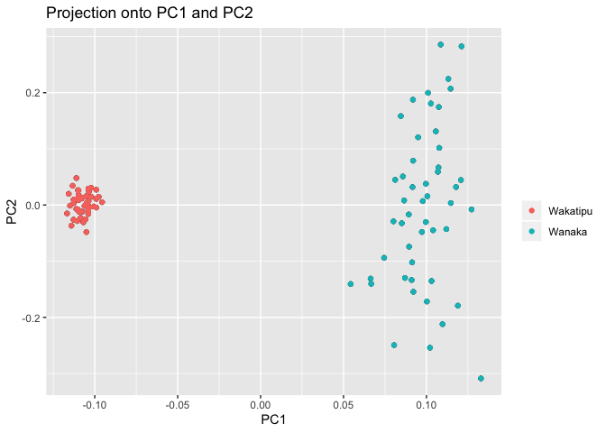

Structure exploration
================
Ludovic Dutoit
10/21/2019

Loading files
-------------

``` r
setwd("/Users/dutlu42p/repos/mahuika/bully_gbs") 
require("pcadapt")
```

    ## Warning: package 'pcadapt' was built under R version 3.5.2

``` r
data <- read.pcadapt("output_files/populations.snps.vcf", type = "vcf") # New dataset
```

    ## No variant got discarded.
    ## Summary:
    ## 
    ##  - input file:               output_files/populations.snps.vcf
    ##  - output file:              /var/folders/1g/hdrjtwrj77b1g8ll485bl2sw0000gq/T//RtmpTaAD7U/file62335dcdfd8b.pcadapt
    ## 
    ##  - number of individuals detected:   94
    ##  - number of loci detected:      9605
    ## 
    ## 9605 lines detected.
    ## 94 columns detected.

``` r
metadata<-read.table("metadata/metadata_clean.txt",h=T)
metadata<-cbind(rownames(metadata),metadata)[1:5]
colnames(metadata)<-c("sample","lake","depth","group","sex")
head(metadata)
```

    ##          sample   lake depth   group sex
    ## WK16-02 WK16-02 Wanaka    90    Deep   m
    ## WK16-16 WK16-16 Wanaka    90    Deep   m
    ## WK16-33 WK16-33 Wanaka    60    Deep   f
    ## WK16-66 WK16-66 Wanaka    15 Shallow   f
    ## WK16-80 WK16-80 Wanaka     5 Shallow   f
    ## WK16-97 WK16-97 Wanaka     5 Shallow   m

Now that we have all the data loaded in, let's have a quick look at the general population structure. We will make a PCA, colored by lake

``` r
x <- pcadapt(input = data, K = 20) 
rownames(x$scores)<-metadata[,1]
colnames(x$scores)<-paste("PC",1:20,sep="")
write.table(x$scores,"output_files/scores_pca.txt",sep="\t")
plot(x, option = "screeplot")
```


``` r
plot(x, option = "scores", pop=metadata$lake) 
```



Coloring by depth:

``` r
plot(x, option = "scores", pop=metadata$group) 
```


Theere seems to be much more variation in Lake wanaka, let's therefore take them as two different datasets to investigate a bit more clearly what is happening.

**Interestingly, it looks like the deep ones are closer to the lake wanaka ones than the shallow ones**

Again, I split the vcf outside of R.

``` bash
cut -f 1 metadata/metadata_clean.txt | grep   -E "WK[-0-9.]+" > wanaka_inds.txt
vcftools --vcf output_files/populations.snps.vcf --keep   wanaka_inds.txt --recode 
mv out.recode.vcf  output_files/wanaka.snps.vcf
vcftools --vcf output_files/populations.snps.vcf --remove   wanaka_inds.txt --recode 
mv out.recode.vcf  output_files/wakatipu.snps.vcf
```

Let's look at the lake-depth structure now:

``` r
#wakatipu
data_wakatipu<- read.pcadapt("output_files/wakatipu.snps.vcf", type = "vcf") 
```

    ## No variant got discarded.
    ## Summary:
    ## 
    ##  - input file:               output_files/wakatipu.snps.vcf
    ##  - output file:              /var/folders/1g/hdrjtwrj77b1g8ll485bl2sw0000gq/T//RtmpTaAD7U/file623377fb21e3.pcadapt
    ## 
    ##  - number of individuals detected:   45
    ##  - number of loci detected:      9605
    ## 
    ## 9605 lines detected.
    ## 45 columns detected.

``` r
metadata_wakatipu<-metadata[which(metadata$lake=="Wakatipu"),] # that is the way we found them, we remove them too
dim(metadata_wakatipu)
```

    ## [1] 45  5

``` r
x_wakatipu <- pcadapt(input = data_wakatipu, K = 20) 

#To plot depth, let's make a color palette

colpal <- colorRampPalette(c("grey", "black"))
colors<-colpal(length(levels(as.factor(metadata_wakatipu$depth))))

plot(x_wakatipu, option = "scores", pop=metadata_wakatipu$depth,col=colors) #Wanaka
```


``` r
plot(x_wakatipu, option = "scores", pop=metadata_wakatipu$group) #Wanaka
```


``` r
#Wanaka
data_wanaka <- read.pcadapt("output_files/wanaka.snps.vcf", type = "vcf") 
```

    ## No variant got discarded.
    ## Summary:
    ## 
    ##  - input file:               output_files/wanaka.snps.vcf
    ##  - output file:              /var/folders/1g/hdrjtwrj77b1g8ll485bl2sw0000gq/T//RtmpTaAD7U/file623386dfb9f.pcadapt
    ## 
    ##  - number of individuals detected:   49
    ##  - number of loci detected:      9605
    ## 
    ## 9605 lines detected.
    ## 49 columns detected.

``` r
metadata_wanaka<-metadata[which(metadata$lake=="Wanaka"),] # that is the way we found them, we remove them too
dim(metadata_wanaka)
```

    ## [1] 49  5

``` r
x_wanaka <- pcadapt(input = data_wanaka, K = 20) 
plot(x_wanaka, option = "scores", pop=metadata_wanaka$depth,col=colors) #Wanaka
```


``` r
plot(x_wanaka, option = "scores", pop=metadata_wanaka$group) #Wanaka
```


There might be a tiny bit of depth structure, but almost nothing.

Open questions: Was the structure we saw before associated to the relatedness of the deep fish of Wakatipu to Wanaka? Is it a visual artifact?

Let's do some structure analysis and some Fst based trees

Structure analsyis
------------------

I run it on Wanaka, Wakatipu, and on both pops together but without outliers. The conversion from vcf to faststructure input files is done using PGDspider2.1.1.5

``` bash

##convert to faststr files

mkdir faststructure plots
conda activate faststr # speciic to the way faststructure  is installed on my computer
structure.py -K 2  --input=output_files/populations.snps--output=faststructure/populations.snps --format=str
structure.py -K 3  --input=output_files/populations.snps--output=faststructure/populations.snps --format=str
structure.py -K 4  --input=output_files/populations.snps--output=faststructure/populations.snps --format=str
structure.py -K 5  --input=output_files/populations.snps--output=faststructure/populations.snps --format=str
structure.py -K 6  --input=output_files/populations.snps--output=faststructure/populations.snps --format=str
structure.py -K 7  --input=output_files/populations.snps--output=faststructure/populations.snps --format=str
structure.py -K 8  --input=output_files/populations.snps--output=faststructure/populations.snps --format=str
structure.py -K 9  --input=output_files/populations.snps--output=faststructure/populations.snps --format=str
structure.py -K 10  --input=output_files/populations.snps--output=faststructure/populations.snps --format=str
#wakatipu
structure.py -K 2  --input=output_files/wakatipu.snps --output=faststructure/wakatipu.snps  --format=str
structure.py -K 3  --input=output_files/wakatipu.snps --output=faststructure/wakatipu.snps  --format=str
structure.py -K 4  --input=output_files/wakatipu.snps --output=faststructure/wakatipu.snps  --format=str
structure.py -K 5  --input=output_files/wakatipu.snps --output=faststructure/wakatipu.snps  --format=str
#wanaka
structure.py -K 2  --input=output_files/wanaka.snps --output=faststructure/wanaka.snps  --format=str
structure.py -K 3 --input=output_files/wanaka.snps --output=faststructure/wanaka.snps  --format=str
structure.py -K 4  --input=output_files/wanaka.snps --output=faststructure/wanaka.snps  --format=str
structure.py -K 5  --input=output_files/wanaka.snps --output=faststructure/wanaka.snps  --format=str

chooseK.py --input=faststructure/wanaka.snps
#Model complexity that maximizes marginal likelihood = 2
#Model components used to explain structure in data = 1
chooseK.py --input=faststructure/wakatipu.snps
#Model complexity that maximizes marginal likelihood = 2
#Model components used to explain structure in data = 1
chooseK.py --input=faststructure/populations.snps.nooutliers.NOMISSING
#Model complexity that maximizes marginal likelihood = 2
#Model components used to explain structure in data = 2
```

The choose K function suggests that only the structure between lake is clearly visible, let's see how it looks like in practice:

``` r
  library("pophelper")
```

    ## Loading required package: ggplot2

    ## Warning: package 'ggplot2' was built under R version 3.5.2

    ## pophelper v2.2.9 ready.

``` r
  for (pop in c("wanaka.snps","wakatipu.snps")){
    print(pop)
      ffiles <- list.files(path="faststructure/",pattern="meanQ")[grep(paste("^",pop,sep=""),perl=T,list.files(path="faststructure/",pattern= "meanQ"))]
      flist <- readQ(files=paste("faststructure/",ffiles,sep=""))
      ###Reading 
      if (pop == "populations.snps") {indcodes <- metadata[,1]}
      if (pop == "wanaka.snps") {indcodes <- metadata_wanaka[,1]}
      if (pop == "wakatipu.snps") {indcodes <- metadata_wakatipu[,1]}
      for (i in 1:length(flist)){
          rownames(flist[[i]]) <-indcodes
      }
  plotQ(flist,imgoutput="join",showindlab=T,useindlab=T,height=7,width=70,grplabangle=0,exportpath=paste("plots/",pop,sep=""),ordergrp=T)
  }
```

    ## [1] "wanaka.snps"
    ## Drawing plot ...

    ## plots/wanaka.snpsJoined4Files-20191029161048.png exported.
    ## [1] "wakatipu.snps"
    ## Drawing plot ...

    ## plots/wakatipu.snpsJoined4Files-20191029161051.png exported.

As these output 3 png files directly, I link them below showing no Structure whatsoever except for the lake specific one. I was going to order things but as the result is a bit trivial and the ordering is not I have not done it for now, will do if we want to resent it!

**Wanaka**


**Wakatipu**


**That looks Ok, but we might reorder them by pop and by depth to look at both lakes together**

### Reordering

``` r
#determine proper order numerically from old order
# to save time I got t
new_order_of_the_94_samples <- c(7,19,29,30,41,42,53,54,65,66,77,89,8,9,20,21,31,43,55,67,78,79,90,91,10,22,32,33,44,45,56,57,68,69,80,92,11,23,81,93,34,46,58,70,82,5,6,17,18,28,40,52,64,76,88,4,16,27,39,51,63,74,75,86,87,15,26,38,49,50,61,62,73,85,3,14,25,36,37,48,60,72,84,94,1,2,12,13,24,35,47,59,71,83)

#find files
filestoread<-paste("faststructure/", list.files(path="faststructure/",pattern="meanQ")[grep(paste("^populations.snps",sep=""),perl=T,list.files(path="faststructure/",pattern= "meanQ"))],sep="")
#reorder every single file according to proper order
for (filename in filestoread){
  print(filename)
  tempdata<-read.table(filename,h=F)
  tempdata<-tempdata[new_order_of_the_94_samples,]
  newfilename = paste(strsplit(filename,".populations")[[1]][1],"/","reordered",strsplit(filename,".populations")[[1]][2],sep="")
  write.table(tempdata,newfilename,quote=F,col.names=F,row.names=F,sep="\t")
}
```

    ## [1] "faststructure/populations.snps.10.meanQ"
    ## [1] "faststructure/populations.snps.2.meanQ"
    ## [1] "faststructure/populations.snps.3.meanQ"
    ## [1] "faststructure/populations.snps.4.meanQ"
    ## [1] "faststructure/populations.snps.5.meanQ"
    ## [1] "faststructure/populations.snps.6.meanQ"
    ## [1] "faststructure/populations.snps.7.meanQ"
    ## [1] "faststructure/populations.snps.8.meanQ"
    ## [1] "faststructure/populations.snps.9.meanQ"

``` r
#play with the metadata and so we have plots with sample names or depth on it
indcodes_v2<-paste(metadata[new_order_of_the_94_samples,1],metadata[new_order_of_the_94_samples,2],metadata[new_order_of_the_94_samples,3],"m",sep="_")

#plot

  ffiles <- list.files(path="faststructure/",pattern="meanQ")[grep(paste("reor",sep=""),perl=T,list.files(path="faststructure/",pattern= "meanQ"))]
      flist <- readQ(files=paste("faststructure/",ffiles,sep=""))

#indcodes_v1

#indcodes_v2
      for (i in 1:length(flist)){
          rownames(flist[[i]]) <-indcodes_v2
}
  plotQ(flist,imgoutput="join",showindlab=T,useindlab=T,height=7,width=70,grplabangle=0,exportpath=paste("plots/reordered.snps",sep=""),ordergrp=T)
```

    ## Drawing plot ...

    ## plots/reordered.snpsJoined9Files-20191029161055.png exported.

``` r
#K=2 alone
  plotQ(flist[2],imgoutput ="sep", showindlab=T,useindlab=T ,height=7,width=35,grplabangle=0,exportpath="plots/K2", rainbow(2),showdiv=TRUE,clustercol=c("red","blue"),divcol="white",divtype=1,divsize=1,sortind=NA,grplab=NA)
```

    ## Drawing plot ...

    ## plots/K2reordered.snps.2.png exported.

**K=2 to K=10** 

**K=2 alone**


Finally get some basic population stats (Fst, Ho)
-------------------------------------------------

``` r
require("hierfstat")
```

    ## Loading required package: hierfstat

``` r
require("vcfR")
```

    ## Loading required package: vcfR

    ## 
    ##    *****       ***   vcfR   ***       *****
    ##    This is vcfR 1.8.0 
    ##      browseVignettes('vcfR') # Documentation
    ##      citation('vcfR') # Citation
    ##    *****       *****      *****       *****

``` r
require("poppr")
```

    ## Loading required package: poppr

    ## Warning: package 'poppr' was built under R version 3.5.2

    ## Loading required package: adegenet

    ## Loading required package: ade4

    ## 
    ##    /// adegenet 2.1.1 is loaded ////////////
    ## 
    ##    > overview: '?adegenet'
    ##    > tutorials/doc/questions: 'adegenetWeb()' 
    ##    > bug reports/feature requests: adegenetIssues()

    ## 
    ## Attaching package: 'adegenet'

    ## The following object is masked from 'package:hierfstat':
    ## 
    ##     read.fstat

    ## This is poppr version 2.8.3. To get started, type package?poppr
    ## OMP parallel support: available

``` r
# a bit of play around wqith convewrsion to get a vcf into hierfstat
dataVCF<-vcf <- read.vcfR("output_files/populations.snps.vcf", verbose = T)
```

    ## Scanning file to determine attributes.
    ## File attributes:
    ##   meta lines: 14
    ##   header_line: 15
    ##   variant count: 9605
    ##   column count: 103
    ## 
    Meta line 14 read in.
    ## All meta lines processed.
    ## gt matrix initialized.
    ## Character matrix gt created.
    ##   Character matrix gt rows: 9605
    ##   Character matrix gt cols: 103
    ##   skip: 0
    ##   nrows: 9605
    ##   row_num: 0
    ## 
    Processed variant 1000
    Processed variant 2000
    Processed variant 3000
    Processed variant 4000
    Processed variant 5000
    Processed variant 6000
    Processed variant 7000
    Processed variant 8000
    Processed variant 9000
    Processed variant: 9605
    ## All variants processed

``` r
geninddata<-vcfR2genind(dataVCF)
geninddata@pop<-(metadata[,2])
#metadata[,1] == rownames(geninddata$tab)
```

dirs, tlet's get some basic stats per lake, per

``` r
hierfstatdataall <-genind2hierfstat(geninddata,pop=paste(metadata[,2],metadata[,4],sep=""))
hierfstatdata2lakes <-genind2hierfstat(geninddata,pop=metadata[,2])

sep_pop <- seppop(geninddata)
hierfstatdatawanaka<-genind2hierfstat(sep_pop$Wanaka,pop=rep(1,49))
hierfstatdatawakatipu<-genind2hierfstat(sep_pop$Wakatipu,pop=rep(1,45))

#Overall
basic.stats(hierfstatdataall)$overall
```

    ##      Ho      Hs      Ht     Dst     Htp    Dstp     Fst    Fstp     Fis 
    ##  0.1281  0.1272  0.1354  0.0082  0.1381  0.0109  0.0604  0.0790 -0.0071 
    ##    Dest 
    ##  0.0125

``` r
#Wanaka
basic.stats(hierfstatdatawanaka)$overall
```

    ##     Ho     Hs     Ht    Dst    Htp   Dstp    Fst   Fstp    Fis   Dest 
    ## 0.1459 0.1468 0.1468 0.0000    NaN    NaN 0.0000    NaN 0.0059    NaN

``` r
#Wakatipu
basic.stats(hierfstatdatawakatipu)$overall
```

    ##      Ho      Hs      Ht     Dst     Htp    Dstp     Fst    Fstp     Fis 
    ##  0.1088  0.1071  0.1071  0.0000     NaN     NaN  0.0000     NaN -0.0161 
    ##    Dest 
    ##     NaN

One can see from this that Wanaka is more variable than Wakatipu!

Now onto some Fst!

``` r
genet.dist(hierfstatdata2lakes)
```

    ##            1
    ## 2 0.03686052

Fst between the two lakes is 0.037

``` r
matrix_4_depth_fst<-as.matrix(genet.dist(hierfstatdataall))
colnames(matrix_4_depth_fst)<-levels(hierfstatdataall$pop)
rownames(matrix_4_depth_fst)<-levels(hierfstatdataall$pop)
matrix_4_depth_fst
```

    ##                 WakatipuDeep WakatipuShallow  WanakaDeep WanakaShallow
    ## WakatipuDeep     0.000000000     0.006690349 0.040902197   0.042989832
    ## WakatipuShallow  0.006690349     0.000000000 0.037284430   0.039463992
    ## WanakaDeep       0.040902197     0.037284430 0.000000000   0.009432146
    ## WanakaShallow    0.042989832     0.039463992 0.009432146   0.000000000

As expected, little to no structure within pop, little between lakes!
