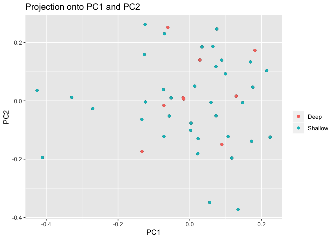
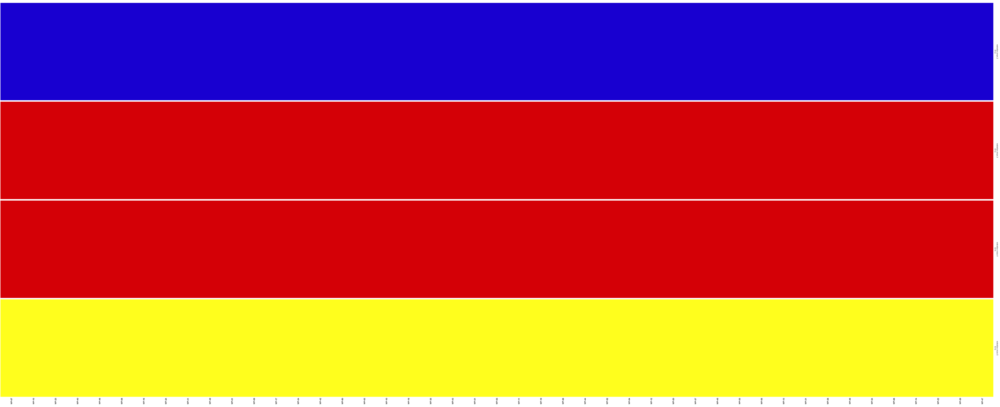

Structure exploration
================
Ludovic Dutoit
10/21/2019

First thing, I create a version without any missing data as we have many SNPs and both

Loading files
-------------

``` r
setwd("/Users/dutlu42p/repos/mahuika/bully_gbs") 
require("pcadapt")
```

    ## Warning: package 'pcadapt' was built under R version 3.5.2

``` r
data <- read.pcadapt("output_files/populations.snps.NOMISSING.vcf", type = "vcf") # New dataset
```

    ## No variant got discarded.
    ## Summary:
    ## 
    ##  - input file:               output_files/populations.snps.NOMISSING.vcf
    ##  - output file:              /var/folders/1g/hdrjtwrj77b1g8ll485bl2sw0000gq/T//RtmpDqR83E/file3e4270e7eec2.pcadapt
    ## 
    ##  - number of individuals detected:   95
    ##  - number of loci detected:      9138
    ## 
    ## 9138 lines detected.
    ## 95 columns detected.

``` r
metadata<-read.table("metadata/metadata_clean.txt",h=T)
metadata<-cbind(rownames(metadata),metadata)[1:5]
colnames(metadata)<-c("sample","lake","depth","group","sex")
head(metadata)
```

    ##          sample   lake depth   group sex
    ## WK16-02 WK16-02 Wanaka    90    Deep   m
    ## WK16-16 WK16-16 Wanaka    90    Deep   m
    ## WK16-33 WK16-33 Wanaka    60    Deep   f
    ## WK16-48 WK16-48 Wanaka    30 Shallow   m
    ## WK16-66 WK16-66 Wanaka    15 Shallow   f
    ## WK16-80 WK16-80 Wanaka     5 Shallow   f

Now that we have all the data loaded in, let's have a quick look at the general population structure. We will make a PCA, colored by lake

``` r
x <- pcadapt(input = data, K = 20) 
plot(x, option = "screeplot")
```


``` r
plot(x, option = "scores", pop=metadata$lake) 
```


There is clear structure by lakes, but a few outliers.

Let's see who they are and remove them for now. As expected, they do cluster by lake, quite strongly in fact. Two individuals are clear outliers, let's remove them and look again.

Which ones are they? I'll pick them up quickly by checking which inds have Pc2 under -0.5:

``` r
metadata$sample[which(x$scores[,2]<=-0.5)]
```

    ## [1] WK16-48 WK16-47
    ## 95 Levels: WK16-02 WK16-03 WK16-04 WK16-06 WK16-11 WK16-13 ... WP-54

WK16-48 WK16-47 are the two outliers, let's remove them. I'll them using vcftools not within R.

``` bash
 vcftools --vcf populations.snps.NOMISSING.vcf --remove-indv  WK16-48 --remove-indv WK16-47 --recode
 mv out.recode.vcf output_files/populations.snps.nooutliers.NOMISSING.vcf
```

[output\_files/populations.snps.nooutliers.NOMISSING.vcf](output_files/populations.snps.nooutliers.NOMISSING.vcf) ccontains exactly the same dataset, but without the two outliers, let's look at it again.

``` r
data_nooutliers <- read.pcadapt("output_files/populations.snps.nooutliers.vcf", type = "vcf") 
```

    ## No variant got discarded.
    ## Summary:
    ## 
    ##  - input file:               output_files/populations.snps.nooutliers.vcf
    ##  - output file:              /var/folders/1g/hdrjtwrj77b1g8ll485bl2sw0000gq/T//RtmpDqR83E/file3e425c310eb6.pcadapt
    ## 
    ##  - number of individuals detected:   93
    ##  - number of loci detected:      9138
    ## 
    ## 9138 lines detected.
    ## 93 columns detected.

``` r
metadata_nooutliers<-metadata[-which(x$scores[,2]<=-0.5),] # that is the way we found them, we remove them too
dim(metadata_nooutliers) # should confirm 93
```

    ## [1] 93  5

``` r
x_nooutliers <- pcadapt(input = data_nooutliers, K = 20) 
plot(x_nooutliers, option = "scores", pop=metadata_nooutliers$lake) 
```


``` r
plot(x_nooutliers, option = "scores", pop=metadata_nooutliers$group) 
```


Theere seems to be much more variation in Lake wanaka, let's therefore take them as two different datasets to investigate a bit more clearly what is happening.

\*\*Interestingly, it looks like the deep ones are closer to the lake wanaka ones, than the Shallow ones

Again, I split the vcf outside of R.

``` bash
cut -f 1 metadata_clean.txt | grep   -E "WK[-0-9.]+" > wanaka_inds.txt
vcftools --vcf output_files/populations.snps.nooutliers.vcf --keep   wanaka_inds.txt --recode 
mv out.recode.vcf  output_files/wanaka.snps.vcf
vcftools --vcf output_files/populations.snps.nooutliers.vcf --remove   wanaka_inds.txt --recode 
mv out.recode.vcf  output_files/wakatipu.snps.vcf
```

Let's look at the lake-depth structure now:

``` r
#wakatipu
data_wakatipu<- read.pcadapt("output_files/wakatipu.snps.vcf", type = "vcf") 
```

    ## No variant got discarded.
    ## Summary:
    ## 
    ##  - input file:               output_files/wakatipu.snps.vcf
    ##  - output file:              /var/folders/1g/hdrjtwrj77b1g8ll485bl2sw0000gq/T//RtmpDqR83E/file3e421fc883a5.pcadapt
    ## 
    ##  - number of individuals detected:   45
    ##  - number of loci detected:      17314
    ## 
    ## 17314 lines detected.
    ## 45 columns detected.

``` r
metadata_wakatipu<-metadata_nooutliers[which(metadata_nooutliers$lake=="Wakatipu"),] # that is the way we found them, we remove them too
dim(metadata_wakatipu)
```

    ## [1] 45  5

``` r
x_wakatipu <- pcadapt(input = data_wakatipu, K = 20) 

#To plot depth, let's make a color palette

colpal <- colorRampPalette(c("grey", "black"))
colors<-colpal(length(levels(as.factor(metadata$depth))))

plot(x_wakatipu, option = "scores", pop=metadata_wakatipu$depth,col=colors) #Wanaka
```


``` r
plot(x_wakatipu, option = "scores", pop=metadata_wakatipu$group) #Wanaka
```



``` r
#Wanaka
data_wanaka <- read.pcadapt("output_files/wanaka.snps.vcf", type = "vcf") 
```

    ## No variant got discarded.
    ## Summary:
    ## 
    ##  - input file:               output_files/wanaka.snps.vcf
    ##  - output file:              /var/folders/1g/hdrjtwrj77b1g8ll485bl2sw0000gq/T//RtmpDqR83E/file3e42253ad5f0.pcadapt
    ## 
    ##  - number of individuals detected:   48
    ##  - number of loci detected:      9138
    ## 
    ## 9138 lines detected.
    ## 48 columns detected.

``` r
metadata_wanaka<-metadata_nooutliers[which(metadata_nooutliers$lake=="Wanaka"),] # that is the way we found them, we remove them too
dim(metadata_wanaka)
```

    ## [1] 48  5

``` r
x_wanaka <- pcadapt(input = data_wanaka, K = 20) 
plot(x_wanaka, option = "scores", pop=metadata_wanaka$depth,col=colors) #Wanaka
```


``` r
plot(x_wanaka, option = "scores", pop=metadata_wanaka$group) #Wanaka
```


There might be a tiny bit of depth structure, but almost nothing.

Open questions: Was the structure we saw before associated to the relatedness of the deep fish of Wakatipu to Wanaka? Is it a visual artifact?

Let's do some structure analysis and some Fst based trees

Structure analsyis
------------------

I run it on Wanaka, Wakatipu, and on both pops together but without outliers. The conversion from vcf to faststructure input files is done using PGDspider2.1.1.5

``` bash

##convert to faststr files

mkdir faststructure plots
conda activate faststr # speciic to the way faststructure  is installed on my computer
structure.py -K 2  --input=output_files/populations.snps.nooutliers.NOMISSING --output=faststructure/populations.snps.nooutliers.NOMISSING  --format=str
structure.py -K 3  --input=output_files/populations.snps.nooutliers.NOMISSING --output=faststructure/populations.snps.nooutliers.NOMISSING  --format=str
structure.py -K 4  --input=output_files/populations.snps.nooutliers.NOMISSING --output=faststructure/populations.snps.nooutliers.NOMISSING  --format=str
structure.py -K 5  --input=output_files/populations.snps.nooutliers.NOMISSING --output=faststructure/populations.snps.nooutliers.NOMISSING  --format=str
structure.py -K 6  --input=output_files/populations.snps.nooutliers.NOMISSING --output=faststructure/populations.snps.nooutliers.NOMISSING  --format=str
structure.py -K 7  --input=output_files/populations.snps.nooutliers.NOMISSING --output=faststructure/populations.snps.nooutliers.NOMISSING  --format=str
structure.py -K 8  --input=output_files/populations.snps.nooutliers.NOMISSING --output=faststructure/populations.snps.nooutliers.NOMISSING  --format=str
structure.py -K 9  --input=output_files/populations.snps.nooutliers.NOMISSING --output=faststructure/populations.snps.nooutliers.NOMISSING  --format=str
structure.py -K 10  --input=output_files/populations.snps.nooutliers.NOMISSING --output=faststructure/populations.snps.nooutliers.NOMISSING  --format=str
#wakatipu
structure.py -K 2  --input=output_files/wakatipu.snps --output=faststructure/wakatipu.snps  --format=str
structure.py -K 3  --input=output_files/wakatipu.snps --output=faststructure/wakatipu.snps  --format=str
structure.py -K 4  --input=output_files/wakatipu.snps --output=faststructure/wakatipu.snps  --format=str
structure.py -K 5  --input=output_files/wakatipu.snps --output=faststructure/wakatipu.snps  --format=str
#wanaka
structure.py -K 2  --input=output_files/wanaka.snps --output=faststructure/wanaka.snps  --format=str
structure.py -K 3 --input=output_files/wanaka.snps --output=faststructure/wanaka.snps  --format=str
structure.py -K 4  --input=output_files/wanaka.snps --output=faststructure/wanaka.snps  --format=str
structure.py -K 5  --input=output_files/wanaka.snps --output=faststructure/wanaka.snps  --format=str

chooseK.py --input=faststructure/wanaka.snps
#Model complexity that maximizes marginal likelihood = 2
#Model components used to explain structure in data = 1
chooseK.py --input=faststructure/wakatipu.snps
#Model complexity that maximizes marginal likelihood = 2
#Model components used to explain structure in data = 1
chooseK.py --input=faststructure/populations.snps.nooutliers.NOMISSING
#Model complexity that maximizes marginal likelihood = 2
#Model components used to explain structure in data = 2
```

The choose K function suggests that only the structure between lake is clearly visible, let's see how it looks like in practice:

``` r
library("pophelper")
```

    ## Loading required package: ggplot2

    ## Warning: package 'ggplot2' was built under R version 3.5.2

    ## pophelper v2.2.9 ready.

``` r
for (pop in c("wanaka.snps","wakatipu.snps","populations.snps.nooutliers.NOMISSING")){
  print(pop)
    ffiles <- list.files(path="faststructure/",pattern="meanQ")[grep(paste("^",pop,sep=""),perl=T,list.files(path="faststructure/",pattern= "meanQ"))]
    flist <- readQ(files=paste("faststructure/",ffiles,sep=""))
    ###Reading 
    if (pop == "populations.snps.nooutliers.NOMISSING") {indcodes <- metadata_nooutliers[,1]}
    if (pop == "wanaka.snps") {indcodes <- metadata_wanaka[,1]}
    if (pop == "wakatipu.snps") {indcodes <- metadata_wakatipu[,1]}
    for (i in 1:length(flist)){
        rownames(flist[[i]]) <-indcodes
    }
plotQ(flist,imgoutput="join",showindlab=T,useindlab=T,height=7,width=70,grplabangle=0,exportpath=paste("plots/",pop,sep=""),ordergrp=T)
}
```

    ## [1] "wanaka.snps"
    ## Drawing plot ...

    ## plots/wanaka.snpsJoined4Files-20191022163520.png exported.
    ## [1] "wakatipu.snps"
    ## Drawing plot ...

    ## plots/wakatipu.snpsJoined4Files-20191022163523.png exported.
    ## [1] "populations.snps.nooutliers.NOMISSING"
    ## Drawing plot ...

    ## plots/populations.snps.nooutliers.NOMISSINGJoined9Files-20191022163526.png exported.

As these output 3 png files directly, I link them below showing no Structure whatsoever except for the lake specific one. I was going to order things but as the result is a bit trivial and the ordering is not I have not done it for now, will do if we want to resent it!

**Wanaka**


**Wakatipu**



**Both lakes together**


